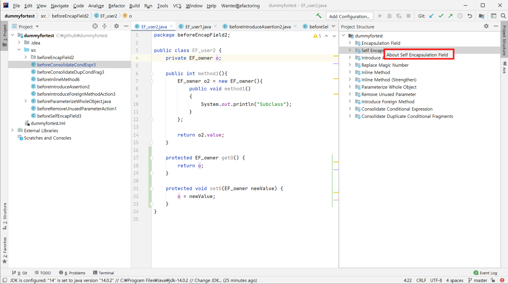

## Project Description

**Automated Refactorings**

Every programmer, including our students, has their own coding style. However, there are some coding styles that contains multiple duplicates, unused parameters, messy class structures, and so on. These kinds of coding style would make their code look messy, hard to read, and most of all, hard to fix or add some new features. As a result, the concept of 'refactoring' was introduced, and these process can make your code more readable, understandable, and comprehensive.

Indeed, our 'Automated Refactoring Plugin' would be helpful for software development, as we mentioned in the earlier paragraph. But also, our project topic is interesting because it has various refactoring techniques with various implementation difficulties. For example, one of our refactoring strategy, 'Inline Method', has quite obvious refactoring process. In contrast, strategy 'Extract Method' is quite challenging because grouping similar statements is very hard to implement in JAVA language.

Our project, 'Automated Refactorings' Plugin deals refactoring by listing available refactoring choices as a tree structure. In addition, if user double clicks particular strategy component, the plugin would navigate project to selected part, highlight codes, and shows pop-up window with two codes composed of non-refactored code and refactored code each. By clicking 'Accept' or 'Decline', programmer can determine whether they would refactor their code or not.

And most of all, every members are interested in code refactoring and want to study clean code. With this project, we can gradually learn about refactoring techniques.

## HOW TO USE

1. Plug-in 설치 후, 화면 우측 탭의 Refactoring Plugin을 클릭
2. 현재 열려있는 있는 파일에 대해 refactoring 가능한 항목들이 리스팅
3. 특정 refactoring 항목을 더블 클릭
4. 새로운 팝업 창이 띄워져 refactoring 이전, 이후 코드를 비교한 이후, 코드에 적용

&nbsp;

## Structure Overview
### Refactoring

### Utils

### UI

## Analysis
### Test Coverage : 88.5 %

&nbsp;

### GUI scenario testing : Complete

1. 플러그인은 프로젝트의 코드를 자동으로 탐색하여 리팩토링이 적용 가능한 코드를 트리 형태로 리스팅해준다. 리팩토링 가능 항목은 트리 형태로 제시되는데, 가장 상위 항목은 프로젝트이며, 그 하위에 가능한 리팩토링 테크닉 카테고리가 있고, 각각의 카테고리 하위에 리팩토링 가능한 클래스, 메소드의 이름이나 line number를 표시한다. 

2. 유저가 사이드탭에 있는 리팩토링 트리를 통해 접근하지 않을 경우, 상단 툴바가 'Nothing here'라는 비활성화된 카테고리를 보여준다.

3. 코드 작성 중 리팩토링이 필요한 항목이 생기면, 오른쪽 트리가 실시간으로 업데이트 된다. 여러 refactoring에 해당하는 경우, 여러 카테고리에 모두 표시한다.

4. 유저가 트리의 component를 더블클릭하면, 해당 파일로 navigating 되면서 해당 부분이 highlighting 된다. 

5. (4에 이어) 유저가 상단 툴바를 클릭하면, 적용 가능한 리팩토링 버튼이 활성화되어 있다. 

6. (5에 이어) 상단 툴바를 통해 적용가능한 리팩토링 버튼을 클릭하면, 리팩토링을 적용하기 전과 적용한 후의 코드를 difference window를 통해 비교할 수 있다. 

7. (6에 이어) Cancel 버튼을 누르면 코드에는 아무런 변화가 일어나지 않는다.

8. (6에 이어) Apply 버튼을 누르면 difference window에 제시되었던 리팩토링이 실제 프로젝트 코드에 반영된다. 

9. 플러그인 트리 구조에서 카테고리에 해당하는 component를 마우스 우클릭하면 컨텍스트 메뉴가 팝업된다. 

10. (8에 이어) 컨텍스트 메뉴를 선택하면 해당 리팩토링에 대한 precondition과 postcondition, 그리고 간단한 코드 예시를 볼 수 있는 팝업창이 열린다. OK버튼을 누르면 창이 닫히고 프로젝트 화면으로 돌아온다.

